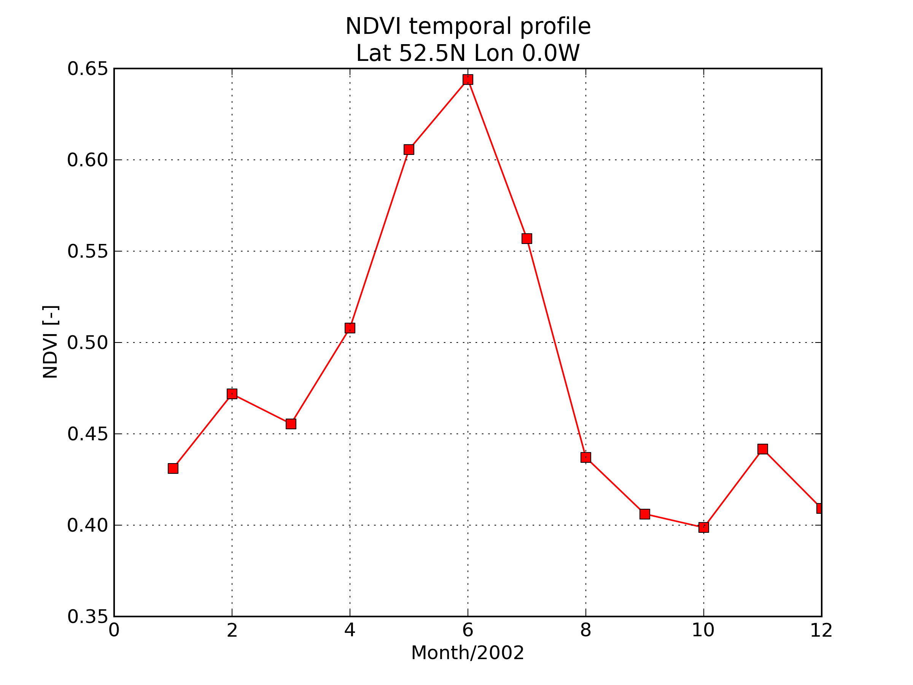

================================================================
Fitting a simple phenology model to satellite observations
================================================================

Phenology refers to the study of timing of recurrent events, such as
leaf emergence, leaf fall, etc. In the context of carbon science, the timing of
emergence of leaves and the duration of the leaf-on period is crucial to 
understand the impact of decidious trees on atmospheric carbon levels. The 
timing of vegetation is also important from the point of view of other ecosystem 
components: vegetation flowering dates and fruit production are an important 
constraint on the temporal behaviour of fruit-eating wildlife, for example. 
Phenology is also important in agricultural practices, as certain management 
practices are only applied at particular phenological stages of crop development.

Monitoring phenology is important also because plant phenology reacts to a 
warmer climate, where leaf emergence happens earlier, and leaf fall happens 
later due to milder winters. Historically, researchers have recorded bud burst,
date of flowering and leaf fall, breeding times, etc. for individual species. 
Phenology networks such as the `USA's phenology network <http://www.usanpn.org/home>`_
or efforts such as the `UK's NatureCalendar <http://www.naturescalendar.org.uk/>'_
rely on meticulous observation of phenology events by dedicated researchers and
members of the public. While these efforts are invaluable, and often allow the
extension of data series way back in the past, they tend to only monitor a handful
of species over a limited geographical extent. Vegetation indices, such as NDVI 
or EVI, broadly respond to the amount of vegetation within the scene, and 
typical temporal trajectories can be used to track the temporal development of 
vegetation and can be related to phenology measurements in the ground. 

   
   The monthly NDVI trajectory for a site located in the UK for 2002.

   
These measurements do not track individual species, as the footprint of typical sensors
such as MODIS, AVHRR or MERIS is of a few hundred meters, and will usually 
result in a mixture of species. A further complication is that the VI is a
combination of soil (and snow) reflectance and vegetation biochemical composition
and structure, so it is hard to associate any point in a typical trajectory
with particular phenological events such as budburst or leaf fall. In these
cases, simple phenology models can be used to interpret the signal. In effect, 
these models provide mathematical functions for that adequately fit the observed
vegetation index. Points of interest in these trajectories can then be easily 
calculated (for example, location of the maximum VI value, inflexion points 
indicating start and end of the green period, total lenght of photosynthetically
active period, etc.).

Plotting NDVI temporal trajectories
-------------------------------------

Some data and code has been provided for you to visualise VI trajectories. We
shall be using the MODIS monthly NDVI product, gridded to a global grid of 
:math:`1.5\times 1.5` degrees. The function ``plot_ndvi`` will plot the complete
time series for a given logitude and latitude. For example, this plots the
NDVI for the gridcell that covers the `Hainich <http://www.bgc-jena.mpg.de/public/carboeur/sites/hainich.html>`_
FluxNet site, an area in Easter Germany where trees are mostly decidious (beech).

.. plot::
   :include-source: 
    
   from phenology import *
   get_ndvi ( 10.25, 51.05, plot=True ) # NDVI around Hainich FluxNET site
   plt.show()

The following plot shows some location near the city of Tomsk, in Siberia.

.. plot::
   :include-source:  
   
   from phenology import *
   get_ndvi ( 86, 57, plot=True) # NDVI around Siberia
   plt.show()

This is the NDVI temporal trajectory for the Tumbarumba Fluxnet site in Australia

.. plot::
   :include-source:  
   
   from phenology import *
   get_ndvi ( 148, -35, plot=True) # Tumbarumba, Oz
   plt.show()     

Try a few sites with different latitude and longitudes, and discuss what the
differences are.

Simple phenology models
=========================

Inspection of typical evolution of vegetation indices like the one carried out
above suggest that a simple phenology model that goes from a minimum to a maximum
and then decreases again may be suitable, at least for the Northern Hemisphere.
One such method used successfully in `De Beurs and Henebry (2008)`_ by using
a simple quadratic function of time:

.. math::
    
    NDVI(t) = at^{2} + bt + c 

.. plot::
   :include-source:
       
   # Import some libraries, in case you haven't yet imported them
   import matplotlib.pyplot as plt
   import numpy as np
   from scipy.optimize import leastsq
   from phenology import *
   # The following line grabs the data, selects 2001 as the year we'll be
   # fitting a qudratic model to, and returns the AGDD, NDVI, parameters, 
   # fitting output message, and forward modelled NDVI for the complete time
   # series (2001-2011).
   retval = fit_phenology_model( 86, 57, [2001], pheno_model="quadratic" )
   plt.subplot ( 2, 1, 1 )
   plt.plot ( retval[1], '-r', label="MODIS NDVI" )
   plt.plot ( retval[-1], '-g', label="Predicted" )
   plt.axvline ( 365, ymin=-0.1, ymax=1.01, lw=1.5)
   plt.rcParams['legend.fontsize'] = 9 # Otherwise too big
   plt.legend(loc='best', fancybox=True, shadow=True ) # Legend
   plt.grid ( True )
   plt.ylabel("NDVI")
   plt.subplot ( 2, 1, 2 )
   plt.plot ( retval[0], '-r' )
   plt.axvline ( 365, ymin=-0.1, ymax=1.01, lw=1.5)
   plt.xlabel ("Time [DoY since 1/1/2001]")
   plt.ylabel (r'AGDD $[^{o}C]')
   print retval[-3] # Print out the fit parameters
   plt.show()     
    
We can see that the quadratic model has some complications even fitting a simple
NDVI profile like that of Siberia. The model, as introduced above, will also 
struggle to cope with NDVI patterns typical of the Southern Hemisphere (unless
a temporal shift is introduced). These limitations have lead to the development
of more complex and robust methods. 

In the previous code snippet, all the work is done by ``fit_phenology_model``. 
This function returns a Python tuple with the following elements:
    
0. AGDD (degrees) for the 11 years of data. Daily data.
1. NDVI for the 11 years of data. Data have been linearly interpolated to daily.
2. Optimal fit parameters 
3. Output message from ``leastsq`` (see `here <http://docs.scipy.org/doc/scipy/reference/tutorial/optimize.html#least-square-fitting-leastsq>`_ for more information)
4. Predicted NDVI for 11 years from using the Optimal fit parameters.

We can also fit several years with the same parameters. Instead of specifying
``[2001]``, we can specify a list with the years we want to fit together, such as
``[2001, 2002, 2003, 2004]``. 

Other methods to fit a model to observations of NDVI rely on Fourier analysis
ideas. Fourier analysis states that within a closed interval, any periodic
function can be expressed as a sum of increasing frequency sine waves:
    
.. math::
    
    NDVI(t) = \overline{NDVI}(t) + \sum_{i=1}^{N/2}A_{i}\cos(2\pi i t/N) + \phi_{i}
    
where :math:`\overline{NDVI}(t)` is the mean NDVI value within the period of 
interest :math:`(0,N)`. :math:`A_{i}` and :math:`\phi_{i}` are the magnitude and
phase of the :math:`i`-th harmonic, respectively. Usually, only a few terms of the
summation are required to produce a reasonable fit to the observations. An added
benefit is that the different harmonics allow for a more detailed exploration of
the temporal dynamics observed by the sensor: the first term (the 0-th harmonic)
can be related to the mean biome amount of vegetation. The first and second
harmonics relate to the dynamics of annual and biannual evoluation of vegetation.
Finally, frequency-domain analysis is fairly robust against noise. However, there
are some shortcomings: data gaps need to be filled in or "padded", and the
frequency at which one can extract information is governed by the periodicity of
the data, wihch in our case is monthly. Also, fast events might be blurred. For
a more in-depht analysis, see e.g. `Moody and Johnson (2001)`_, and the related
slightly more sophisticated method presented in `Hernance et al. (2007)`_.

.. plot::
    :include-source:
        
    # Import some libraries, in case you haven't yet imported them
    import matplotlib.pyplot as plt
    import numpy as np
    from scipy.optimize import leastsq
    from phenology import *
    # The following line grabs the data, selects 2001 as the year we'll be
    # fitting a qudratic model to, and returns the AGDD, NDVI, parameters, 
    # fitting output message, and forward modelled NDVI for the complete time
    # series (2001-2011).
    retval = fit_phenology_model( 86, 57, [2001], pheno_model="fourier")
    plt.subplot ( 2, 1, 1 )
    plt.plot ( retval[1], '-r', label="MODIS NDVI" )
    plt.plot ( retval[-1], '-g', label="Predicted" )
    plt.axvline ( 365, ymin=-0.1, ymax=1.01, lw=1.5)
    plt.rcParams['legend.fontsize'] = 9 # Otherwise too big
    plt.legend(loc='best', fancybox=True, shadow=True ) # Legend
    plt.grid ( True )
    plt.ylabel("NDVI")
    plt.subplot ( 2, 1, 2 )
    plt.plot ( retval[0], '-r' )
    plt.axvline ( 365, ymin=-0.1, ymax=1.01, lw=1.5)
    plt.xlabel ("Time [DoY since 1/1/2001]")
    plt.ylabel ("AGDD")
    print retval[-3] # Print out the fit parameters
    plt.show()
   
This code demonstrates that the fit using the Fourier model is good, as the 
VI trajectory we are using can be well approximated by a sum of sinusoids. Note
that since in this case we also solve for phase shifts, this model fits other
type of phenologies, such as the Tumbarumba site, quite well:
    
.. plot::
        
    # Import some libraries, in case you haven't yet imported them
    import matplotlib.pyplot as plt
    import numpy as np
    from scipy.optimize import leastsq
    from phenology import *
    # The following line grabs the data, selects 2001 as the year we'll be
    # fitting a qudratic model to, and returns the AGDD, NDVI, parameters, 
    # fitting output message, and forward modelled NDVI for the complete time
    # series (2001-2011).
    retval = fit_phenology_model( 148, -35, [2001], pheno_model="fourier")
    plt.subplot ( 2, 1, 1 )
    plt.plot ( retval[1], '-r', label="MODIS NDVI" )
    plt.plot ( retval[-1], '-g', label="Predicted" )
    plt.axvline ( 365, ymin=-0.1, ymax=1.01, lw=1.5)
    plt.rcParams['legend.fontsize'] = 9 # Otherwise too big
    plt.legend(loc='best', fancybox=True, shadow=True ) # Legend
    plt.grid ( True )
    plt.ylabel("NDVI")
    plt.subplot ( 2, 1, 2 )
    plt.plot ( retval[0], '-r' )
    plt.axvline ( 365, ymin=-0.1, ymax=1.01, lw=1.5)
    plt.xlabel ("Time [DoY since 1/1/2001]")
    plt.ylabel ("AGDD")
    print retval[-3] # Print out the fit parameters
    plt.show()
   

Other models have been developed in the literature, that make use
of different temporal template shapes (such as asymetric Gaussian functions, or
the double logistic function). A double logistic model (after e.g. 
`Zhang et al. (2003)`_ or `Sobrino and Julien (2011)`_ ) is given by 

.. math::
    
   NDVI(t) &= NDVI_{0} + \Delta NDVI\cdot\left[\frac{1}{1+\exp(m_{s}(t-s))}+  \frac{1}{1+\exp(m_{a}(t-a))} - 1 \right]
   
   
The model effectively has 6 parameters, of which two relate to the variation in
the vegetation index (:math:`NDVI_{0}`, the minimum value of the VI, and
:math:`\Delta NDVI`, the difference between maximum and minimum NDVI). The other
parameters relate to the shape of the ascending logistic function that models
greening up (:math:`m_{s}` and :math:'s') and the onset of senescence 
(:math:`m_{a}` and :math:`a`). We can relate :math:`s` and :math:`a` to the
beginning and end of the photosynthetically active period (i.e., shift in time),
and :math:`m_s` and :math:`m_a` to the location of the inflexion point in the
logistic curves.  

.. plot::
    :include-source:
        
    # Import some libraries, in case you haven't yet imported them
    import matplotlib.pyplot as plt
    import numpy as np
    from scipy.optimize import leastsq
    from phenology import *
    # The following line grabs the data, selects 2001 as the year we'll be
    # fitting a qudratic model to, and returns the AGDD, NDVI, parameters, 
    # fitting output message, and forward modelled NDVI for the complete time
    # series (2001-2011).
    retval = fit_phenology_model( 86, 57, [2001], pheno_model="dbl_logistic")
    plt.subplot ( 2, 1, 1 )
    plt.plot ( retval[1], '-r', label="MODIS NDVI" )
    plt.plot ( retval[-1], '-g', label="Predicted" )
    plt.axvline ( 365, ymin=-0.1, ymax=1.01, lw=1.5)
    plt.rcParams['legend.fontsize'] = 9 # Otherwise too big
    plt.legend(loc='best', fancybox=True, shadow=True ) # Legend
    plt.grid ( True )
    plt.ylabel("NDVI")
    plt.subplot ( 2, 1, 2 )
    plt.plot ( retval[0], '-r' )
    plt.axvline ( 365, ymin=-0.1, ymax=1.01, lw=1.5)
    plt.xlabel ("Time [DoY since 1/1/2001]")
    plt.ylabel ("AGDD")
    print retval[-3] # Print out the fit parameters
    plt.show()

Relating phenology to meteorological forcings
================================================

In the previous section we have fitted phenological models to observations of 
vegetation indices. We can use the parameters that we recovered for each year to
relate them to meteorological observations, or to look for trends. To this end,
we shall be using as a meteorological 

Accessing the AGDD data
------------------------

Data from the `ERA interim archive <http://data-portal.ecmwf.int/data/d/interim_daily/>`_
have been prepared. The data available for this practial is the mean daily 
temperature. Some functions have been provided for you to access the data easily:

.. plot::
   :include-source: 
  
   # Import some libraries, in case you haven't yet imported them
   import matplotlib.pyplot as plt
   import numpy as np
   from phenology import *
   # These next few lines retrieve the mean daily temperature and
   # AGDD for the three sites mentioned above
   ( temp_hainich, agdd_hainich ) = calculate_gdd( 2005, \
            latitude=51, longitude=10 )
   ( temp_tomsk, agdd_tomsk ) = calculate_gdd( 2005, \
            latitude=57, longitude=86 )
   ( temp_tumbarumba, agdd_tumbarumba ) = calculate_gdd( 2005, \
            latitude=-35, longitude=148 )
   # Temporal range for plots
   t_range =  np.arange ( 1, 366 )
   # First subplot is Hainich (DE)
   agdd_plots ( 3, 1, 10, 40, t_range, temp_hainich, agdd_hainich )
   agdd_plots ( 3, 2, 10, 40, t_range, temp_tomsk, agdd_tomsk )
   agdd_plots ( 3, 3, 10, 40, t_range, temp_tumbarumba, agdd_tumbarumba )
   plt.xlabel("DoY/2005")
   plt.rcParams['legend.fontsize'] = 9 # Otherwise too big
   plt.legend(loc='best', fancybox=True, shadow=True ) # Legend
   plt.show()
            
Examine the previous plots, noting particularly the inflexion points in the 
AGDD curve, and how they relate to the base and maximum mean daily temperatures
(shown in the grey area). Also not how for the Tumbarumba site, there is a 
seasonality shift with respect to the Northern Hemisphere sites. 

A way to explore this is to use the fitted models and look for their inflexion
points. These smooth functionals are easy to inspect than the noisy NDVI series
(particularly if you were using daily data with no angular correction). You can
find an analytic expression for the onset of greenness and start of senescence
as (respectively) the maximum and minimum value of the first derivative.

.. plot::
    :include-source:
        
    # Import some libraries, in case you haven't yet imported them
    import matplotlib.pyplot as plt
    import numpy as np
    from scipy.optimize import leastsq
    from phenology import *
    # The following line grabs the data, selects 2001 as the year we'll be
    # fitting a qudratic model to, and returns the AGDD, NDVI, parameters, 
    # fitting output message, and forward modelled NDVI for the complete time
    # series (2001-2011).
    retval = fit_phenology_model( 86, 57, [2001], pheno_model="dbl_logistic")
    # Plot the fitted curve for year 2001
    plt.plot ( retval[-1][:365], '-r', label="Fit")
    # Plot the observations of NDVI
    plt.plot ( retval[-1][:365], '-g', label="Obs")
    # Onset of senescence is the minimum of the derivative 
    doy_senesc = np.diff(retval[-1][:365]).argmin()
    # I get 297 for this
    # Onset of greenness is the minimum of the derivative 
    doy_green = np.diff(retval[-1][:365]).argmax()
    # I get 109 for my example
    plt.axvline ( doy_green, ymin=0, ymax=0.95, color='g', lw=1.5 )
    plt.axvline ( doy_senesc, ymin=0, ymax=0.95, color='k', lw=1.5 )
    plt.grid ( True )
    plt.xlabel("DoY/2005")
    plt.rcParams['legend.fontsize'] = 9 # Otherwise too big
    plt.legend(loc='best', fancybox=True, shadow=True ) # Legend
    plt.title ( "Tomsk \nAGDD OG: %f AGDD OS: %f AGDD AP:%f" % \
        ( retval[0][doy_green], retval[0][doy_senesc], \
        retval[0][doy_senesc] - retval[0][doy_green] ) ) 
    plt.show()

.. plot::
        
    # Import some libraries, in case you haven't yet imported them
    import matplotlib.pyplot as plt
    import numpy as np
    from scipy.optimize import leastsq
    from phenology import *
    # The following line grabs the data, selects 2001 as the year we'll be
    # fitting a qudratic model to, and returns the AGDD, NDVI, parameters, 
    # fitting output message, and forward modelled NDVI for the complete time
    # series (2001-2011).
    retval = fit_phenology_model( 10, 51, [2001], pheno_model="dbl_logistic")
    # Plot the fitted curve for year 2001
    plt.plot ( retval[-1][:365], '-r', label="Fit")
    # Plot the observations of NDVI
    plt.plot ( retval[-1][:365], '-g', label="Obs")
    # Onset of senescence is the minimum of the derivative 
    doy_senesc = np.diff(retval[-1][:365]).argmin()
    # I get 297 for this
    # Onset of greenness is the minimum of the derivative 
    doy_green = np.diff(retval[-1][:365]).argmax()
    # I get 109 for my example
    plt.axvline ( doy_green, ymin=0, ymax=0.95, color='g', lw=1.5 )
    plt.axvline ( doy_senesc, ymin=0, ymax=0.95, color='k', lw=1.5 )
    plt.grid ( True )
    plt.xlabel("DoY/2005")
    plt.rcParams['legend.fontsize'] = 9 # Otherwise too big
    plt.legend(loc='best', fancybox=True, shadow=True ) # Legend
    plt.title ( "Hainich \nAGDD OG: %f AGDD OS: %f AGDD AP:%f" % \
        ( retval[0][doy_green], retval[0][doy_senesc], \
        retval[0][doy_senesc] - retval[0][doy_green] ) ) 
    plt.show()

.. plot::
        
    # Import some libraries, in case you haven't yet imported them
    import matplotlib.pyplot as plt
    import numpy as np
    from scipy.optimize import leastsq
    from phenology import *
    # The following line grabs the data, selects 2001 as the year we'll be
    # fitting a qudratic model to, and returns the AGDD, NDVI, parameters, 
    # fitting output message, and forward modelled NDVI for the complete time
    # series (2001-2011).
    retval = fit_phenology_model( 148, -35, [2001], pheno_model="dbl_logistic")
    # Plot the fitted curve for year 2001
    plt.plot ( retval[-1][:365], '-r', label="Fit")
    # Plot the observations of NDVI
    plt.plot ( retval[-1][:365], '-g', label="Obs")
    # Onset of senescence is the minimum of the derivative 
    doy_senesc = np.diff(retval[-1][:365]).argmin()
    # I get 297 for this
    # Onset of greenness is the minimum of the derivative 
    doy_green = np.diff(retval[-1][:365]).argmax()
    # I get 109 for my example
    plt.axvline ( doy_green, ymin=0, ymax=0.95, color='g', lw=1.5 )
    plt.axvline ( doy_senesc, ymin=0, ymax=0.95, color='k', lw=1.5 )
    plt.grid ( True )
    plt.xlabel("DoY/2005")
    plt.rcParams['legend.fontsize'] = 9 # Otherwise too big
    plt.legend(loc='best', fancybox=True, shadow=True ) # Legend
    plt.title ( "Tumbarumba \nAGDD OG: %f AGDD OS: %f AGDD AP:%f" % \
        ( retval[0][doy_green], retval[0][doy_senesc], \
        retval[0][doy_senesc] - retval[0][doy_green] ) ) 
    plt.show()

.. _De Beurs and Henebry (2008): http://geography.vt.edu/deBeurs_Henebry_JClimate.pdf
.. _Hernance et al. (2007): http://ieeexplore.ieee.org//xpls/abs_all.jsp?arnumber=4305366
.. _Sobrino and Julien (2011): http://www.uv.es/juy/Doc/Sobrino_GIMMS-global-trends_IJRS_2011.pdf

.. _Zhang et al. (2003): http://www.sciencedirect.com/science/article/pii/S0034425702001359
.. _Moody and Johnson (2001): ftp://ftp.ccrs.nrcan.gc.ca/ftp/ad/Phenology/PhenologyPapers/Moody_2001_AVHRR_DFourierTransPhenology_USA.pdf